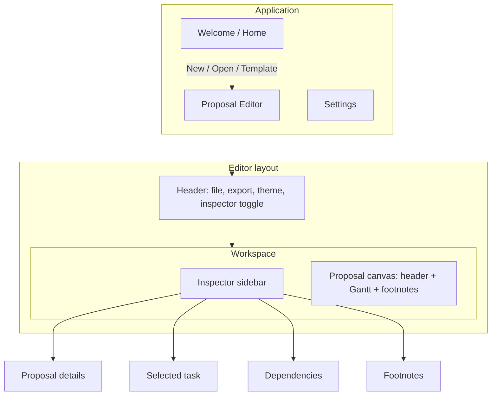

# Proposal Gantt — Product Assessment & v1.0 Plan

**Status:** Post-MVP prototype (v0.1)  
**Purpose:** Honest audit of what exists, what hurts, and a wireframed spec to build the real product on.

---

## 1. Where we are today

Proposal Gantt is a **desktop Electron app** for pre-sales teams to build **client-facing project timelines**, save them as `.pgantt` files, and export PNG/PDF into proposals.

| Layer | What exists |
|-------|-------------|
| **Shell** | Electron 37, React 19, Vite, TypeScript |
| **Chart** | `@svar-ui/react-gantt` 2.7 (MIT) — grid + chart in one component |
| **Domain logic** | ~330 lines FS scheduling (`dependencies.ts`), ~270 lines timeline (`timeline.ts`) |
| **UI** | ~2,100 lines React across 15 components |
| **Persistence** | JSON `.pgantt` via native file dialogs |
| **Export** | html2canvas + jsPDF of white “proposal card” |
| **Tests** | One manual script (`scripts/verify-scheduling.ts`), no CI test runner |

The prototype **works for a demo** and **real editing sessions**, but it was built by **extending an MVP vertically** (layout revamp → inline edit → links → milestones) without pausing to **reshape architecture** for a shippable product.

---

## 2. What’s good (keep and build on)

### 2.1 Product focus is sharp
- Not trying to be MS Project. The **proposal card + export** mental model is right for pre-sales.
- **Relative timeline** (“Month 1, Week 2”) vs **calendar mode** maps to how proposals are sold before a firm start date.

### 2.2 Scheduling core is valuable
- **Finish-to-start dependencies with lag** (gap preservation on drag) — this was hard to get right and is a differentiator for proposal tools.
- Cycle detection, link intercept, and cascade logic live in testable pure functions (`dependencies.ts`).
- The **verify-scheduling script** (8 cases) is a good seed for a real test suite.

### 2.3 Editing surface is surprisingly complete for v0.1
| Capability | Implementation |
|------------|----------------|
| Inline task name, start, duration | Grid column editors |
| Add task / add phase | `AddRowCell` + `add-task` intercept |
| Milestone toggle | `MilestoneToggleCell` |
| Drag rows between phases | Native `move-task` + fixed `tasksChanged` sync |
| Drag bars on chart | Gantt + FS reschedule |
| Visual link mode | Custom `useDragToLink` + corner hit targets |
| Dependencies list | Inspector → Links tab |

### 2.4 Layout revamp direction is correct
- **Chart-first** workspace, collapsible inspector, grouped header, theme swatches.
- **White export frame** inside dark chrome — correct separation of “working UI” vs “deliverable”.

### 2.5 File format is simple and versionable
```json
{ "version": 1, "meta": { ... }, "tasks": [...], "links": [...] }
```
Easy to diff in Git, migrate, and extend.

---

## 3. What’s bad (fix before calling it v1.0)

### 3.1 Architecture — `GanttView` is a god component (~410 lines)

Everything critical lives in one file:
- API `init` with 6+ intercepts/handlers
- Sync pipeline (`syncFromApi`)
- Link mode state
- Column assembly
- Chart ↔ React state reconciliation

**Risk:** Any Gantt library quirk becomes a game of whack-a-mole (we already hit: duplicate Week 1, wrong `movedTaskId` on drop, stale `end` dates).

**Recommendation:** Extract modules:

```
lib/gantt/
  sync.ts          — serialize ↔ document, scheduling hook
  intercepts.ts    — add-task, add-link, update-task normalization
  columns.ts       — column definitions
hooks/
  useGanttApi.ts   — init, refs, event wiring
```

### 3.2 Tight coupling to SVAR internals

Custom CSS targets `.wx-link`, `.wx-bar`, `.wx-grid`. Custom drag-to-link bypasses the library’s link UI. **Upgrading `@svar-ui/react-gantt` is high-risk.**

**Recommendation:**  
- Pin version + document extension points.  
- Consider a thin **adapter interface** so chart vendor could swap later (even if we don’t swap soon).

### 3.3 No real test or CI story

- `verify-scheduling.ts` is not in `npm test`.
- Zero component/integration tests.
- No GitHub Actions.

**Recommendation:** Vitest for `dependencies.ts`, `timeline.ts`, `tasks.ts`; Playwright smoke for “open template → drag → save”.

### 3.4 Interaction model is crowded

Users must learn **three drag systems**:

| Gesture | Effect |
|---------|--------|
| Drag bar on chart | Move/resize task dates |
| Drag row in grid | Reorder / reparent |
| Link mode corner drag | Add FS dependency |

Toolbar hints help but **modes conflict** (link mode vs row grab cursor).

**Recommendation:** Unified **toolbar mode switcher**: Select · Schedule · Link. Only one primary drag semantics active.

### 3.5 Inspector is document-centric, not task-centric

Inspector edits **proposal metadata** (title, client, notes). It does **not** show the **selected task** (owner, notes, lag, predecessors). Power users will expect clicking a task to open task details.

### 3.6 Missing table-stakes PM features (even for proposals)

| Missing | Impact |
|---------|--------|
| Undo / redo | Fear of breaking timelines |
| Delete task (obvious UI) | Rely on unknown Gantt shortcut? |
| Edit link **lag** in UI | Can only preserve lag by dragging |
| Progress % | Field exists, no UI |
| Summary roll-up dates | Phases may not reflect children |
| Recent files | Welcome screen only has templates |
| Autosave / recovery | Data loss on crash |
| Export preview / margins | WYSIWYG export surprises |

### 3.7 Electron security & polish

- `sandbox: false` in `webPreferences`
- No auto-updater, no crash reporting
- Menu bar hidden — shortcuts undocumented in-app

### 3.8 Documentation drift

README still describes v0.1 feature set. No `AGENTS.md`, no architecture doc (until this file).

---

## 4. Product vision (v1.0)

> **Proposal Gantt helps pre-sales teams produce credible, beautiful project timelines in minutes — with dependencies that behave correctly — and export them client-ready.**

### Target user
Pre-sales consultant, solutions engineer, or bid manager preparing **SOWs, proposals, and pitch decks**.

### Non-goals for v1.0
- Resource loading / leveling  
- Critical path / baselines (SVAR PRO features)  
- Real-time multi-user collaboration  
- MS Project import/export  
- Hour-level scheduling  

### Success metrics (v1.0)
1. New user → exported PDF in **< 10 minutes** (timed onboarding)  
2. FS drag preserves lag in **100%** of scripted scenarios (automated)  
3. Zero data loss on crash (autosave)  
4. Installers work on macOS + Windows without dev environment  

---

## 5. Information architecture



### Inspector tabs (v1.0 target)

| Tab | Content |
|-----|---------|
| **Proposal** | Title, client, prepared by, date, timeline mode |
| **Task** | Selected task only — name, type, start, duration, milestone, lag from predecessor |
| **Links** | All FS links + add/remove (existing panel) |
| **Notes** | Proposal footnotes (existing) |

When nothing is selected, **Task** tab shows empty state: “Select a row to edit task details.”

---

## 6. Wireframes

### 6.1 Welcome (enhanced)

```
┌─────────────────────────────────────────────────────────────────────────────┐
│                         ◆  Proposal Gantt                                   │
│              Client-ready timelines for pre-sales proposals                 │
│                                                                             │
│   ┌──────────────────────┐    ┌──────────────────────┐                   │
│   │  +  Blank proposal   │    │  📁  Open file        │                   │
│   └──────────────────────┘    └──────────────────────┘                   │
│                                                                             │
│   RECENT                                                          See all → │
│   ┌─────────────────────────────────────────────────────────────────────┐   │
│   │ Acme — Platform Implementation          edited 2h ago    .pgantt   │   │
│   │ Globex — Consulting Roadmap             edited yesterday             │   │
│   └─────────────────────────────────────────────────────────────────────┘   │
│                                                                             │
│   TEMPLATES                                                                 │
│   ┌─────────────────────────┐  ┌─────────────────────────┐                 │
│   │ Software Implementation │  │ Consulting Engagement │                 │
│   └─────────────────────────┘  └─────────────────────────┘                 │
│                                                                             │
└─────────────────────────────────────────────────────────────────────────────┘
```

### 6.2 Main editor (v1.0 target)

```
┌──────────────────────────────────────────────────────────────────────────────┐
│ [≡] ◆ Proposal Gantt │ Acme Platform ▪ unsaved     [New][Open][Save] [PNG][PDF] │
│                      │ ○○○○○ themes    Mode: [Select▾]  [Inspector ◀]      │
├──────────────┬───────────────────────────────────────────────────────────────┤
│ INSPECTOR    │  ┌─ PROPOSAL CARD (export area) ─────────────────────────────┐  │
│ ┌──────────┐ │  │ Enterprise Platform Implementation                      │  │
│ │Proposal  │ │  │ Prepared for Acme Corporation          Relative · Days  │  │
│ │Task      │ │  ├─────────────────────────────────────────────────────────┤  │
│ │Links     │ │  │ [Relative|Start date]  [Days|Months|Years]  [Link off] │  │
│ │Notes     │ │  ├──────────┬────────┬───────┬────────────────────────────┤  │
│ └──────────┘ │  │ Task    ◆│ Start  │ Days  │ ░░░░░░░░░░░░░░░░░░░░░░░░░ │  │
│              │  │ ▼ Phase 1│ Month 1│ 14d   │ ████████████████████████   │  │
│  SELECTED    │  │   Kickoff│ Day 1  │  3d   │ ███                        │  │
│  TASK        │  │   Delivery│Day 4  │  7d   │       ███████              │  │
│  ─────────   │  │   Go-live ◆│ Day 14│  —   │                 ◆          │  │
│  Name        │  │ [+][📁]  │        │       │                            │  │
│  [Kickoff  ] │  └──────────┴────────┴───────┴────────────────────────────┘  │
│  Type        │  │ Assumptions: dedicated client resources...               │  │
│  (•) Task    │  └─────────────────────────────────────────────────────────┘  │
│  ( ) Milestone│                                                              │
│  Start Day 1 │                                                              │
│  Duration 3d │                                                              │
│  Lag: —      │                                                              │
└──────────────┴───────────────────────────────────────────────────────────────┘
```

**Mode switcher (header or toolbar):**

| Mode | Chart drag | Grid drag | Link corners |
|------|------------|-----------|--------------|
| **Select** | — | Reparent / reorder | Hidden |
| **Schedule** | Move / resize bars | — | Hidden |
| **Link** | — | — | Visible |

### 6.3 Export preview (new)

```
┌─────────────────────────────────────────────────────────┐
│ Export proposal timeline                          [×]   │
├─────────────────────────────────────────────────────────┤
│  ┌─────────────────────────────────────────────────┐    │
│  │         (live preview of proposal card)          │    │
│  └─────────────────────────────────────────────────┘    │
│  Format:  (•) PDF   ( ) PNG                             │
│  Paper:   [ A4 landscape ▾ ]                            │
│  Margins: [ Normal ▾ ]                                  │
│                                                         │
│                        [ Cancel ]  [ Export… ]        │
└─────────────────────────────────────────────────────────┘
```

### 6.4 Settings (lightweight v1.0)

```
┌─────────────────────────────────────────┐
│ Settings                                │
├─────────────────────────────────────────┤
│ General                                 │
│   Default theme:     [ Ocean ▾ ]      │
│   Default timeline:  [ Relative ▾ ]     │
│   Autosave:          [✓] every 60s    │
│                                         │
│ Shortcuts                          [?]  │
│   ⌘N New   ⌘O Open   ⌘S Save   ⌘Z Undo │
└─────────────────────────────────────────┘
```

---

## 7. Roadmap (build order)

### Phase A — Foundation (2–3 weeks)
**Goal:** Safe to iterate without regressions.

| # | Work item | Outcome |
|---|-----------|---------|
| A1 | Split `GanttView` into sync / intercepts / columns | Maintainable chart layer |
| A2 | Vitest + `npm test` for scheduling & timeline | CI gate |
| A3 | `tasksChanged` + integration test for reparent/add | Grid ops stay synced |
| A4 | Pin + document SVAR extension points | Upgrade path |
| A5 | `sandbox: true`, preload audit | Security baseline |

### Phase B — Editor UX (2–3 weeks)
**Goal:** Feel like a real app, not a chart demo.

| # | Work item | Outcome |
|---|-----------|---------|
| B1 | **Task** inspector tab (selection from grid/chart) | Contextual editing |
| B2 | Toolbar **mode switcher** (Select / Schedule / Link) | Clear interactions |
| B3 | Undo / redo (start with document-level history) | User confidence |
| B4 | Delete task/phase (keyboard + context menu) | Obvious removal |
| B5 | Link lag editor in Task or Links tab | Control without drag |
| B6 | Recent files on Welcome | Faster return |

### Phase C — Deliverable quality (1–2 weeks)
**Goal:** What exports is what they expect.

| # | Work item | Outcome |
|---|-----------|---------|
| C1 | Export preview modal + page size | WYSIWYG PDF |
| C2 | Summary phase date roll-up from children | Accurate phases |
| C3 | Autosave to temp + recovery prompt | No lost work |
| C4 | In-app shortcut help overlay | Discoverability |

### Phase D — Ship (1 week)
| # | Work item |
|---|-----------|
| D1 | Signed installers (macOS + Windows) |
| D2 | Smoke E2E (Playwright against `npm run dev`) |
| D3 | README + changelog aligned to v1.0 |
| D4 | Sample `.pgantt` gallery |

### Future (v1.1+)
- Org-wide template sync / shared template library (beyond local user folder)  
- Brand kit (logo on export card, custom fonts)  
- Duplicate proposal / merge timelines  
- Optional web viewer (read-only share link) — **out of scope for v1.0 (§9)**  
- SS / FF link types if proposals need them  

---

## 8. Technical spec notes

### 8.1 State management (v1.0 recommendation)

Keep **React document state** in `App.tsx` as source of truth. Add:

```typescript
// documentReducer or useReducer
type DocumentAction =
  | { type: 'tasks/set'; tasks: GanttTask[] }
  | { type: 'meta/patch'; patch: Partial<ProposalMeta> }
  | { type: 'undo' }
  | { type: 'redo' }
```

Gantt API remains a **view** that syncs via adapter — not a second source of truth long-term.

### 8.2 Selection model

```typescript
interface EditorSelection {
  taskId: string | number | null
  source: 'grid' | 'chart' | null
}
```

Single selection drives Task inspector tab. Multi-select is out of scope for v1.0.

### 8.3 File format v1 (no breaking change yet)

Stay on `version: 1`. Add optional fields:

```typescript
interface ProposalMeta {
  // existing...
  brandColor?: string      // v1.0 optional
  exportDefaults?: { format: 'pdf' | 'png'; paper: 'a4' | 'letter' }
}
```

### 8.4 Testing pyramid

```
        ┌─────────────┐
        │ Playwright  │  3–5 smoke flows
        ├─────────────┤
        │  Vitest     │  dependencies, timeline, tasks, document
        └─────────────┘
```

---

## 9. Product decisions

All items below were open before Phase B; **all decided 2026-07-01.**

| # | Question | Decision |
|---|----------|----------|
| 1 | **Web version** or desktop-only for v1.0? | **Desktop only** — Electron app; no web build or read-only viewer in v1.0 |
| 2 | **Summary roll-up** automatic or manual? | **Auto from children** — phase/summary start, end, and duration derive from child tasks; no manual override in v1.0 |
| 3 | **Lag default** when linking? | **0 days** — successor starts the day after predecessor ends (FS, no gap) unless user sets lag later (B5 UI) |
| 4 | **Template storage** | **User folder** — templates live under the app’s local user-data directory (e.g. `%APPDATA%/Proposal Gantt/Templates` on Windows); bundled starters remain for first-run; users can add/save templates there |
| 5 | **Licensing** | **None** — free internal use only; not a commercial product; no license enforcement or paid tier in v1.0 |

**Implementation notes:** Roll-up → Phase C2. Zero-day lag on new links → `addFsDependency` + link mode (B5). User template folder → Welcome screen + save-as-template flow (Phase B/D). Web viewer deferred to v1.1+ (§7 Future).

---

## 10. Summary scorecard

| Area | Score | Note |
|------|-------|------|
| Core scheduling | ★★★★☆ | FS + lag works; needs tests & lag UI |
| Editing UX | ★★★☆☆ | Rich but mode-heavy |
| Visual design | ★★★★☆ | Revamp is strong; export card works |
| Architecture | ★★☆☆☆ | God component + vendor coupling |
| Reliability | ★★☆☆☆ | No autosave, no undo, minimal tests |
| Ship readiness | ★★☆☆☆ | Prototype yes, product no |

**Verdict:** The MVP proved the **concept and scheduling moat**. The real app needs **architecture cleanup**, **interaction simplification**, **task-centric inspector**, and **ship hygiene** — not more features on the current foundation.

---

## 11. Implementation delta (living record)

**Last updated:** 2026-07-02  
**Baseline:** This spec was written at **v0.1 / post-MVP** (see §1).  
**Latest push:** `d5a4ebe` — Phase B1–B2 (task inspector + mode switcher).  
**Working tree (uncommitted):** Phase B3–B6 (undo/redo, delete, lag editor, recent files).

Use this section as the **source of truth for progress**. Update it when a roadmap item ships or when scope intentionally changes.

### 11.1 How to read this

| Symbol | Meaning |
|--------|---------|
| ✅ Done | Shipped and usable |
| ⚠️ Partial | Started or subset only |
| ❌ Not started | In spec, not built |
| ➕ Beyond spec | Built but not in original v1.0 plan |

---

### 11.2 Completed from spec (§2 “keep and build on”)

| Item | Ref | Status | Notes |
|------|-----|--------|-------|
| Proposal card + export model | §2.1 | ✅ | White `export-frame` inside dark chrome |
| Relative vs calendar timeline | §2.1 | ✅ | Toolbar + inspector project start |
| FS dependencies + lag (backend) | §2.2 | ✅ | `dependencies.ts`; lag preserved on drag after bugfixes |
| `verify-scheduling.ts` (8 cases) | §2.2 | ✅ | Migrated to Vitest (`dependencies.scheduling.test.ts`) |
| Inline task name / start / duration | §2.3 | ✅ | Grid column editors |
| Add task / add phase | §2.3 | ✅ | `AddRowCell` + `add-task` intercept |
| Milestone toggle | §2.3 | ✅ | `MilestoneToggleCell` |
| Drag rows between phases | §2.3 | ✅ | `move-task` + `tasksChanged` sync |
| Drag bars + FS reschedule | §2.3 | ✅ | Drop-only sync; predecessor-earlier bug fixed |
| Visual link mode | §2.3 | ✅ | `useDragToLink`; handle positioning fixed |
| Dependencies list | §2.3 | ✅ | Inspector → **Links** tab |
| Chart-first layout | §2.4 | ✅ | Collapsible inspector, grouped header |
| Theme swatches | §2.4 | ✅ | Header — **session only** (not in `.pgantt`) |
| `.pgantt` v1 JSON | §2.5 | ✅ | `version: 1` unchanged |

---

### 11.3 Improved beyond spec (not in §7 roadmap)

| Item | Status | Notes |
|------|--------|-------|
| Full visual design pass | ➕ ✅ | Plus Jakarta / Instrument Serif, asymmetric welcome, refined export card |
| Timeline zoom + autofit | ➕ ✅ | Hours · Days · Weeks · Months · Years; `ganttZoom.ts`; Fit button |
| `timelineZoom` in document meta | ➕ ✅ | Persisted in `.pgantt`; not in §8.3 |
| Scheduling bugfixes | ➕ ✅ | `movedTaskIdRef` on drop; no live sync during `drag-task` |
| Duplicate timeline headers fix | ➕ ✅ | Epoch-aligned relative scales; `autoScale={false}` |
| `tasks.ts` module | ➕ ⚠️ | `tasksChanged`, milestone helpers — partial Phase A1 |
| `docs/product-spec-v2.md` | ➕ ✅ | This document |
| Custom colors / `brandColor` | ➕ ❌ | Discussed; not implemented |

**Spec conflict:** §4 non-goals include *hour-level scheduling*. We added **hour zoom view** only (not hour-based task duration).

---

### 11.4 Roadmap progress (§7)

#### Phase A — Foundation

| ID | Work item | Status | Evidence |
|----|-----------|--------|----------|
| A1 | Split `GanttView` | ✅ | `GanttView` ~220 lines; `lib/gantt/sync.ts`, `columns.ts`, `intercepts.ts`, `apiHandlers.ts`, `hooks/useGanttApi.ts` |
| A2 | Vitest + `npm test` | ✅ | Vitest 4; 45 unit tests; `.github/workflows/ci.yml` (test + e2e jobs) |
| A3 | Reparent/add integration tests | ✅ | `taskOps.test.ts` — add-task intercept, reparent + FS scheduling |
| A4 | Pin + document SVAR extensions | ✅ | Pinned `2.7.1`; `docs/svar-extensions.md` |
| A5 | `sandbox: true`, preload audit | ✅ | Hardened `webPreferences`; `docs/electron-security.md`; preload exposes only `api` + toolkit |

**Phase A overall:** ✅ **Complete** — safe to iterate; proceed to Phase B.

#### Phase B — Editor UX

| ID | Work item | Status | Evidence |
|----|-----------|--------|----------|
| B1 | **Task** inspector tab | ✅ | `TaskPanel.tsx`; `select-task` → `selectedTaskId`; auto-opens Task tab |
| B2 | Mode switcher (Select / Schedule / Link) | ✅ | `GanttView` toolbar; `apiHandlers` intercepts `drag-task` / `move-task` per mode |
| B3 | Undo / redo | ✅ | `documentHistory.ts`; header + ⌘Z / ⌘⇧Z — ⚠️ per-keystroke history on text fields (see §11.11) |
| B4 | Delete task/phase UI | ✅ | `TaskPanel` + Delete/Backspace; `delete-task` intercept |
| B5 | Link lag editor | ✅ | Editable lag in Task tab; `setFsLinkLag` |
| B6 | Recent files on Welcome | ✅ | `recentFiles.ts` + `openFilePath` IPC |

**Phase B overall:** ✅ **Complete** — editor UX items B1–B6 shipped.

#### Phase C — Deliverable quality

| ID | Work item | Status |
|----|-----------|--------|
| C1 | Export preview modal + page size | ❌ |
| C2 | Summary phase date roll-up | ❌ |
| C3 | Autosave + recovery | ❌ |
| C4 | In-app shortcut help | ❌ |

**Phase C overall:** 0%.

#### Phase D — Ship

| ID | Work item | Status |
|----|-----------|--------|
| D1 | Signed installers | ⚠️ | `electron-builder` scripts exist; not validated in CI |
| D2 | Playwright smoke E2E | ✅ | `e2e/smoke.spec.ts`; CI `e2e` job; browser `window.api` shim in `lib/devApi.ts` |
| D3 | README + changelog v1.0 | ❌ | README still describes v0.1 |
| D4 | Sample `.pgantt` gallery | ⚠️ | Two bundled templates only |

**Phase D overall:** ~25%.

#### Post–Phase A audit fixes (2026-07-02)

| Item | Status | Notes |
|------|--------|-------|
| Add-row / milestone controlled sync | ✅ | `taskMutations.ts`, `GanttChartContext`; no `api.exec('add-task')` from cells |
| Dependency arrow viewport | ✅ | SVAR `_visibleLinks` empty until chart scroll; `lib/gantt/chartViewport.ts` auto-scrolls to linked tasks |
| Browser dev `window.api` shim | ✅ | Save downloads `.pgantt`; Open warns in Vite-only dev |
| Playwright smoke + CI | ✅ | Add row, link mode, template links, save shim |
| Calendar zoom format strings | ✅ | `ganttZoom.ts` uses `date-fns` formatters (not `%b` literals) |

---

### 11.5 Wireframe vs built (§6)

| Wireframe | Target | Built | Gap |
|-----------|--------|-------|-----|
| §6.1 Welcome | Recent files list | Recent section (localStorage + open by path) | ✅ |
| §6.2 Inspector tabs | Proposal / **Task** / Links / Notes | Proposal / Task / Links / Notes | ✅ |
| §6.2 Toolbar zoom | `[Days\|Months\|Years]` | Zoom presets (Hour…Year) | Different control — chart zoom, not column unit only |
| §6.2 Toolbar modes | Select / Schedule / Link | Select / Schedule / Link + inspector toggle | ✅ |
| §6.3 Export preview | Modal with paper/margins | Direct header PNG/PDF | **PNG/PDF broken** — `html2canvas` + `color-mix()` CSS (§11.11); no preview modal |
| §6.4 Settings | Theme default, autosave, shortcuts | ❌ | — |

---

### 11.6 Table-stakes checklist (§3.6)

Copy for sprint planning — check off as shipped:

- [x] Undo / redo
- [x] Delete task (visible UI + keyboard)
- [x] Edit link lag in UI
- [ ] Progress % UI
- [ ] Summary roll-up dates from children
- [x] Recent files on Welcome
- [ ] Autosave / crash recovery
- [ ] Export preview / margins
- [ ] Persist theme / brand color in `.pgantt`
- [x] Task inspector (selection-driven)

---

### 11.7 Known issues / tech debt (carry forward)

| Issue | Severity | Notes |
|-------|----------|-------|
| **PNG/PDF export broken** | **High** | `html2canvas` throws on `color-mix()` in `app.css`; no download in browser or Electron until export subtree uses parseable colors |
| Undo per-keystroke | Medium | `documentHistory` records each `onChange`; single ⌘Z reverts one character in text fields — debounce or commit-on-blur recommended |
| `GanttView` complexity | Medium | Split into sync/columns/hook; further splits as features land |
| SVAR `.wx-*` coupling | High | Upgrade risk; link layer + zoom fragile |
| Interaction mode overlap | ✅ Resolved | B2 mode switcher + intercepts; verified in browser audit §11.11 |
| Theme not in file format | Low | Reopen resets accent |
| README drift | Low | Update when calling v1.0 |
| Browser dev: Open / Recent open | Low | `window.api.openFile` / `openFilePath` need Electron; Save shim works |

---

### 11.8 Updated scorecard (2026-07-02)

| Area | Spec (§10) | Now | Delta |
|------|------------|-----|-------|
| Core scheduling | ★★★★☆ | ★★★★☆ | Bugfixes; Vitest + CI |
| Editing UX | ★★★☆☆ | ★★★★★ | Phase B complete: task inspector, modes, undo, delete, lag, recent |
| Visual design | ★★★★☆ | ★★★★★ | Design pass exceeded spec |
| Architecture | ★★☆☆☆ | ★★★☆☆ | Chart layer split; `documentHistory`; still SVAR-coupled |
| Reliability | ★★☆☆☆ | ★★★☆☆ | 45 unit + smoke E2E; undo; no autosave |
| Ship readiness | ★★☆☆☆ | ★★★☆☆ | Phase B done; **export broken** blocks deliverable path |

**Verdict (Jul 2026):** Credible **internal demo** with full editor UX. **Not** v1.0-ready: fix export, then Phase C (autosave, export preview, roll-up).

---

### 11.9 Recommended next steps (ordered)

**Product decisions (§9):** Desktop only; auto summary roll-up; 0-day lag on new links; templates in local user-data folder; free internal use (no licensing).

1. **Fix PNG/PDF export** — remove or scope `color-mix()` from export capture subtree (`html2canvas` blocker; §11.11)  
2. **Commit Phase B3–B6** — undo/redo, delete, lag editor, recent files (in working tree)  
3. **Undo debounce** — batch text-field edits before pushing history  
4. **Phase C3** — Autosave (success metric §4.3)  
5. **Phase C1** — Export preview modal + page size  
6. **Then** — Custom colors / `brandColor` (§Future v1.1+, user request queued)

*Phase A complete 2026-07-01. Post–Phase A audit + Phase B1–B2 pushed `d5a4ebe`. Full browser UI audit 2026-07-02.*

---

### 11.10 Changelog (high level)

| Date | Commit / milestone | Summary |
|------|-------------------|---------|
| — | `bc7b633` | Initial MVP: Electron, Gantt, FS deps, templates, export |
| 2026-07-01 | `c31248b` | Layout revamp, inspector tabs, inline edit, milestones, add/reparent, scheduling fixes, zoom/autofit, visual polish, product spec |
| 2026-07-01 | — | §9 decisions: auto summary roll-up; 0-day default lag on new links |
| 2026-07-01 | — | §9 closed: desktop-only; user-data template folder; free internal use (no licensing) |
| 2026-07-01 | — | Phase A start: Vitest + CI, scheduling/tasks/timeline tests, `GanttView` split into sync/columns/hook |
| 2026-07-01 | — | Phase A complete: intercepts split, task ops tests, SVAR docs, sandbox + preload audit |
| 2026-07-02 | — | Audit fixes: controlled add/milestone, chart viewport sync for dependency arrows, dev API shim, Playwright smoke + CI e2e job |
| 2026-07-02 | `d5a4ebe` | Phase B1–B2: Task inspector tab, Select/Schedule/Link mode switcher |
| 2026-07-02 | — | Phase B3–B6 (local): undo/redo, delete UI, lag editor, recent files |
| 2026-07-02 | — | Full browser UI audit (§11.11): 48/51 controls pass; PNG/PDF export broken |

*Add a row here when merging significant work.*

---

### 11.11 Full browser UI audit (2026-07-02)

**Environment:** `npm run dev` at `http://localhost:5173` (Vite + `devApi` shim). Playwright MCP, all buttons/fields/controls exercised.

#### Summary

| Result | Count |
|--------|-------|
| Pass | 48 |
| Broken | 2 (PNG, Export PDF) |
| Skipped (native dialog / Electron only) | 3 (Open, Welcome Open, Recent open) |

#### Welcome screen

| Control | Result |
|---------|--------|
| New proposal | ✅ Opens editor |
| Open existing | ⏭ Native dialog — Electron only |
| Software Implementation template | ✅ |
| Consulting Engagement template | ✅ |
| Recent files (after Save) | ✅ Section appears |
| Recent file click | ⏭ `openFilePath` — Electron only |

#### Header

| Control | Result |
|---------|--------|
| Hide / Show inspector | ✅ |
| New | ✅ |
| Open | ⏭ Native dialog |
| Save | ✅ Downloads `.pgantt` |
| Undo / Redo | ✅ (disabled until edit; see per-keystroke note) |
| PNG | ❌ `html2canvas`: unsupported `color-mix()` |
| Export PDF | ❌ Same root cause |
| Theme swatches (all 5) | ✅ |

#### Inspector

| Tab / control | Result |
|---------------|--------|
| Proposal — Title, Client, Prepared by, Date | ✅ Title syncs export card |
| Proposal — Project start (calendar mode) | ✅ |
| Task — empty state, selection, Name, Type, Duration | ✅ |
| Task — Start (relative + calendar) | ✅ |
| Task — Lag editor | ✅ When inbound FS link exists |
| Task — Delete task / phase | ✅ |
| Links — add/remove FS dependency | ✅ |
| Notes — Footnotes | ✅ Syncs export footer |

#### Gantt toolbar

| Control | Result |
|---------|--------|
| Select / Schedule / Link | ✅ Correct `interaction-*` classes |
| Relative / Start date | ✅ |
| Zoom presets (Hours–Years), in/out, Fit | ✅ |

#### Grid row actions

| Control | Result |
|---------|--------|
| Add task to phase | ✅ |
| Mark as milestone / Convert to task | ✅ |

#### Keyboard

| Shortcut | Result |
|----------|--------|
| Delete (task selected) | ✅ |
| ⌘Z / ⌘⇧Z | ✅ Per edit event (text = per keystroke) |

#### Root cause: export failure

`App.tsx` uses `html2canvas` on `.export-frame`. Modern CSS `color-mix(in srgb, …)` in `app.css` (themes, buttons, gantt accents) is not parsed by html2canvas → uncaught error, no file download.

**Fix direction:** Export-only CSS without `color-mix`, or pre-resolve computed styles before capture.

#### UX note: undo granularity

Typing a task name pushes one history entry per `onChange`. One ⌘Z after typing `XYZ` yields `XY`, not the prior name. Recommend debounce (~300ms) or commit on blur for text fields.

---

*Next step: Keep §11 updated each sprint. Before new user-facing features, prefer unchecked items in §11.6 and open issues in §11.7 unless explicitly reprioritized.*

