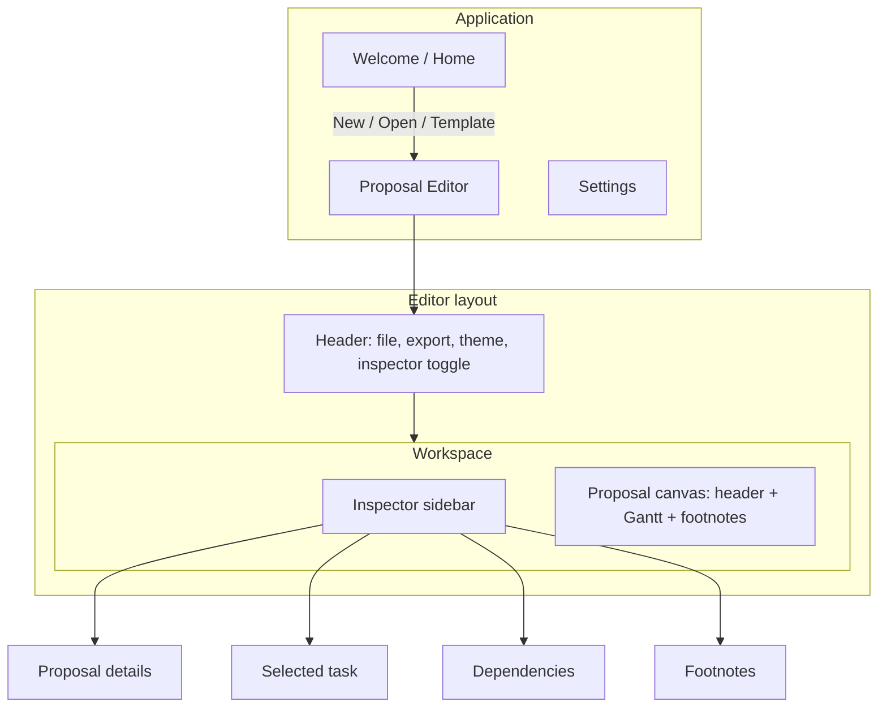

# Proposal Gantt — Product Assessment & v1.0 Plan

**Status:** Post-MVP prototype (v0.1)  
**Purpose:** Honest audit of what exists, what hurts, and a wireframed spec to build the real product on.

---

## 1. Where we are today

Proposal Gantt is a **desktop Electron app** for pre-sales teams to build **client-facing project timelines**, save them as `.pgantt` files, and export PNG/PDF into proposals.

| Layer | What exists |
|-------|-------------|
| **Shell** | Electron 37, React 19, Vite, TypeScript |
| **Chart** | `@svar-ui/react-gantt` 2.7 (MIT) — grid + chart in one component |
| **Domain logic** | ~330 lines FS scheduling (`dependencies.ts`), ~270 lines timeline (`timeline.ts`) |
| **UI** | ~2,100 lines React across 15 components |
| **Persistence** | JSON `.pgantt` via native file dialogs |
| **Export** | html2canvas + jsPDF of white “proposal card” |
| **Tests** | One manual script (`scripts/verify-scheduling.ts`), no CI test runner |

The prototype **works for a demo** and **real editing sessions**, but it was built by **extending an MVP vertically** (layout revamp → inline edit → links → milestones) without pausing to **reshape architecture** for a shippable product.

---

## 2. What’s good (keep and build on)

### 2.1 Product focus is sharp
- Not trying to be MS Project. The **proposal card + export** mental model is right for pre-sales.
- **Relative timeline** (“Month 1, Week 2”) vs **calendar mode** maps to how proposals are sold before a firm start date.

### 2.2 Scheduling core is valuable
- **Finish-to-start dependencies with lag** (gap preservation on drag) — this was hard to get right and is a differentiator for proposal tools.
- Cycle detection, link intercept, and cascade logic live in testable pure functions (`dependencies.ts`).
- The **verify-scheduling script** (8 cases) is a good seed for a real test suite.

### 2.3 Editing surface is surprisingly complete for v0.1
| Capability | Implementation |
|------------|----------------|
| Inline task name, start, duration | Grid column editors |
| Add task / add phase | `AddRowCell` + `add-task` intercept |
| Milestone toggle | `MilestoneToggleCell` |
| Drag rows between phases | Native `move-task` + fixed `tasksChanged` sync |
| Drag bars on chart | Gantt + FS reschedule |
| Visual link mode | Custom `useDragToLink` + corner hit targets |
| Dependencies list | Inspector → Links tab |

### 2.4 Layout revamp direction is correct
- **Chart-first** workspace, collapsible inspector, grouped header, theme swatches.
- **White export frame** inside dark chrome — correct separation of “working UI” vs “deliverable”.

### 2.5 File format is simple and versionable
```json
{ "version": 1, "meta": { ... }, "tasks": [...], "links": [...] }
```
Easy to diff in Git, migrate, and extend.

---

## 3. What’s bad (fix before calling it v1.0)

### 3.1 Architecture — `GanttView` is a god component (~410 lines)

Everything critical lives in one file:
- API `init` with 6+ intercepts/handlers
- Sync pipeline (`syncFromApi`)
- Link mode state
- Column assembly
- Chart ↔ React state reconciliation

**Risk:** Any Gantt library quirk becomes a game of whack-a-mole (we already hit: duplicate Week 1, wrong `movedTaskId` on drop, stale `end` dates).

**Recommendation:** Extract modules:

```
lib/gantt/
  sync.ts          — serialize ↔ document, scheduling hook
  intercepts.ts    — add-task, add-link, update-task normalization
  columns.ts       — column definitions
hooks/
  useGanttApi.ts   — init, refs, event wiring
```

### 3.2 Tight coupling to SVAR internals

Custom CSS targets `.wx-link`, `.wx-bar`, `.wx-grid`. Custom drag-to-link bypasses the library’s link UI. **Upgrading `@svar-ui/react-gantt` is high-risk.**

**Recommendation:**  
- Pin version + document extension points.  
- Consider a thin **adapter interface** so chart vendor could swap later (even if we don’t swap soon).

### 3.3 No real test or CI story

- `verify-scheduling.ts` is not in `npm test`.
- Zero component/integration tests.
- No GitHub Actions.

**Recommendation:** Vitest for `dependencies.ts`, `timeline.ts`, `tasks.ts`; Playwright smoke for “open template → drag → save”.

### 3.4 Interaction model is crowded

Users must learn **three drag systems**:

| Gesture | Effect |
|---------|--------|
| Drag bar on chart | Move/resize task dates |
| Drag row in grid | Reorder / reparent |
| Link mode corner drag | Add FS dependency |

Toolbar hints help but **modes conflict** (link mode vs row grab cursor).

**Recommendation:** Unified **toolbar mode switcher**: Select · Schedule · Link. Only one primary drag semantics active.

### 3.5 Inspector is document-centric, not task-centric

Inspector edits **proposal metadata** (title, client, notes). It does **not** show the **selected task** (owner, notes, lag, predecessors). Power users will expect clicking a task to open task details.

### 3.6 Missing table-stakes PM features (even for proposals)

| Missing | Impact |
|---------|--------|
| Undo / redo | Fear of breaking timelines |
| Delete task (obvious UI) | Rely on unknown Gantt shortcut? |
| Edit link **lag** in UI | Can only preserve lag by dragging |
| Progress % | Field exists, no UI |
| Summary roll-up dates | Phases may not reflect children |
| Recent files | Welcome screen only has templates |
| Autosave / recovery | Data loss on crash |
| Export preview / margins | WYSIWYG export surprises |

### 3.7 Electron security & polish

- `sandbox: false` in `webPreferences`
- No auto-updater, no crash reporting
- Menu bar hidden — shortcuts undocumented in-app

### 3.8 Documentation drift

README still describes v0.1 feature set. No `AGENTS.md`, no architecture doc (until this file).

---

## 4. Product vision (v1.0)

> **Proposal Gantt helps pre-sales teams produce credible, beautiful project timelines in minutes — with dependencies that behave correctly — and export them client-ready.**

### Target user
Pre-sales consultant, solutions engineer, or bid manager preparing **SOWs, proposals, and pitch decks**.

### Non-goals for v1.0
- Resource loading / leveling  
- Critical path / baselines (SVAR PRO features)  
- Real-time multi-user collaboration  
- MS Project import/export  
- Hour-level scheduling  

### Success metrics (v1.0)
1. New user → exported PDF in **< 10 minutes** (timed onboarding)  
2. FS drag preserves lag in **100%** of scripted scenarios (automated)  
3. Zero data loss on crash (autosave)  
4. Installers work on macOS + Windows without dev environment  

---

## 5. Information architecture



### Inspector tabs (v1.0 target)

| Tab | Content |
|-----|---------|
| **Proposal** | Title, client, prepared by, date, timeline mode |
| **Task** | Selected task only — name, type, start, duration, milestone, lag from predecessor |
| **Links** | All FS links + add/remove (existing panel) |
| **Notes** | Proposal footnotes (existing) |

When nothing is selected, **Task** tab shows empty state: “Select a row to edit task details.”

---

## 6. Wireframes

### 6.1 Welcome (enhanced)

```
┌─────────────────────────────────────────────────────────────────────────────┐
│                         ◆  Proposal Gantt                                   │
│              Client-ready timelines for pre-sales proposals                 │
│                                                                             │
│   ┌──────────────────────┐    ┌──────────────────────┐                   │
│   │  +  Blank proposal   │    │  📁  Open file        │                   │
│   └──────────────────────┘    └──────────────────────┘                   │
│                                                                             │
│   RECENT                                                          See all → │
│   ┌─────────────────────────────────────────────────────────────────────┐   │
│   │ Acme — Platform Implementation          edited 2h ago    .pgantt   │   │
│   │ Globex — Consulting Roadmap             edited yesterday             │   │
│   └─────────────────────────────────────────────────────────────────────┘   │
│                                                                             │
│   TEMPLATES                                                                 │
│   ┌─────────────────────────┐  ┌─────────────────────────┐                 │
│   │ Software Implementation │  │ Consulting Engagement │                 │
│   └─────────────────────────┘  └─────────────────────────┘                 │
│                                                                             │
└─────────────────────────────────────────────────────────────────────────────┘
```

### 6.2 Main editor (v1.0 target)

```
┌──────────────────────────────────────────────────────────────────────────────┐
│ [≡] ◆ Proposal Gantt │ Acme Platform ▪ unsaved     [New][Open][Save] [PNG][PDF] │
│                      │ ○○○○○ themes    Mode: [Select▾]  [Inspector ◀]      │
├──────────────┬───────────────────────────────────────────────────────────────┤
│ INSPECTOR    │  ┌─ PROPOSAL CARD (export area) ─────────────────────────────┐  │
│ ┌──────────┐ │  │ Enterprise Platform Implementation                      │  │
│ │Proposal  │ │  │ Prepared for Acme Corporation          Relative · Days  │  │
│ │Task      │ │  ├─────────────────────────────────────────────────────────┤  │
│ │Links     │ │  │ [Relative|Start date]  [Days|Months|Years]  [Link off] │  │
│ │Notes     │ │  ├──────────┬────────┬───────┬────────────────────────────┤  │
│ └──────────┘ │  │ Task    ◆│ Start  │ Days  │ ░░░░░░░░░░░░░░░░░░░░░░░░░ │  │
│              │  │ ▼ Phase 1│ Month 1│ 14d   │ ████████████████████████   │  │
│  SELECTED    │  │   Kickoff│ Day 1  │  3d   │ ███                        │  │
│  TASK        │  │   Delivery│Day 4  │  7d   │       ███████              │  │
│  ─────────   │  │   Go-live ◆│ Day 14│  —   │                 ◆          │  │
│  Name        │  │ [+][📁]  │        │       │                            │  │
│  [Kickoff  ] │  └──────────┴────────┴───────┴────────────────────────────┘  │
│  Type        │  │ Assumptions: dedicated client resources...               │  │
│  (•) Task    │  └─────────────────────────────────────────────────────────┘  │
│  ( ) Milestone│                                                              │
│  Start Day 1 │                                                              │
│  Duration 3d │                                                              │
│  Lag: —      │                                                              │
└──────────────┴───────────────────────────────────────────────────────────────┘
```

**Mode switcher (header or toolbar):**

| Mode | Chart drag | Grid drag | Link corners |
|------|------------|-----------|--------------|
| **Select** | — | Reparent / reorder | Hidden |
| **Schedule** | Move / resize bars | — | Hidden |
| **Link** | — | — | Visible |

### 6.3 Export preview (new)

```
┌─────────────────────────────────────────────────────────┐
│ Export proposal timeline                          [×]   │
├─────────────────────────────────────────────────────────┤
│  ┌─────────────────────────────────────────────────┐    │
│  │         (live preview of proposal card)          │    │
│  └─────────────────────────────────────────────────┘    │
│  Format:  (•) PDF   ( ) PNG                             │
│  Paper:   [ A4 landscape ▾ ]                            │
│  Margins: [ Normal ▾ ]                                  │
│                                                         │
│                        [ Cancel ]  [ Export… ]        │
└─────────────────────────────────────────────────────────┘
```

### 6.4 Settings (lightweight v1.0)

```
┌─────────────────────────────────────────┐
│ Settings                                │
├─────────────────────────────────────────┤
│ General                                 │
│   Default theme:     [ Ocean ▾ ]      │
│   Default timeline:  [ Relative ▾ ]     │
│   Autosave:          [✓] every 60s    │
│                                         │
│ Shortcuts                          [?]  │
│   ⌘N New   ⌘O Open   ⌘S Save   ⌘Z Undo │
└─────────────────────────────────────────┘
```

---

## 7. Roadmap (build order)

### Phase A — Foundation (2–3 weeks)
**Goal:** Safe to iterate without regressions.

| # | Work item | Outcome |
|---|-----------|---------|
| A1 | Split `GanttView` into sync / intercepts / columns | Maintainable chart layer |
| A2 | Vitest + `npm test` for scheduling & timeline | CI gate |
| A3 | `tasksChanged` + integration test for reparent/add | Grid ops stay synced |
| A4 | Pin + document SVAR extension points | Upgrade path |
| A5 | `sandbox: true`, preload audit | Security baseline |

### Phase B — Editor UX (2–3 weeks)
**Goal:** Feel like a real app, not a chart demo.

| # | Work item | Outcome |
|---|-----------|---------|
| B1 | **Task** inspector tab (selection from grid/chart) | Contextual editing |
| B2 | Toolbar **mode switcher** (Select / Schedule / Link) | Clear interactions |
| B3 | Undo / redo (start with document-level history) | User confidence |
| B4 | Delete task/phase (keyboard + context menu) | Obvious removal |
| B5 | Link lag editor in Task or Links tab | Control without drag |
| B6 | Recent files on Welcome | Faster return |

### Phase C — Deliverable quality (1–2 weeks)
**Goal:** What exports is what they expect.

| # | Work item | Outcome |
|---|-----------|---------|
| C1 | Export preview modal + page size | WYSIWYG PDF |
| C2 | Summary phase date roll-up from children | Accurate phases |
| C3 | Autosave to temp + recovery prompt | No lost work |
| C4 | In-app shortcut help overlay | Discoverability |

### Phase D — Ship (1 week)
| # | Work item |
|---|-----------|
| D1 | Signed installers (macOS + Windows) |
| D2 | Smoke E2E (Playwright against `npm run dev`) |
| D3 | README + changelog aligned to v1.0 |
| D4 | Sample `.pgantt` gallery |

### Future (v1.1+)
- Custom template library / org templates  
- Brand kit (logo on export card, custom fonts)  
- Duplicate proposal / merge timelines  
- Optional web viewer (read-only share link)  
- SS / FF link types if proposals need them  

---

## 8. Technical spec notes

### 8.1 State management (v1.0 recommendation)

Keep **React document state** in `App.tsx` as source of truth. Add:

```typescript
// documentReducer or useReducer
type DocumentAction =
  | { type: 'tasks/set'; tasks: GanttTask[] }
  | { type: 'meta/patch'; patch: Partial<ProposalMeta> }
  | { type: 'undo' }
  | { type: 'redo' }
```

Gantt API remains a **view** that syncs via adapter — not a second source of truth long-term.

### 8.2 Selection model

```typescript
interface EditorSelection {
  taskId: string | number | null
  source: 'grid' | 'chart' | null
}
```

Single selection drives Task inspector tab. Multi-select is out of scope for v1.0.

### 8.3 File format v1 (no breaking change yet)

Stay on `version: 1`. Add optional fields:

```typescript
interface ProposalMeta {
  // existing...
  brandColor?: string      // v1.0 optional
  exportDefaults?: { format: 'pdf' | 'png'; paper: 'a4' | 'letter' }
}
```

### 8.4 Testing pyramid

```
        ┌─────────────┐
        │ Playwright  │  3–5 smoke flows
        ├─────────────┤
        │  Vitest     │  dependencies, timeline, tasks, document
        └─────────────┘
```

---

## 9. Open questions (decide before Phase B)

| # | Question | Options |
|---|----------|---------|
| 1 | **Web version** or desktop-only for v1.0? | Desktop first (current) vs Tauri/Electron + web export |
| 2 | **Summary roll-up** automatic or manual? | Auto from children vs editable override |
| 3 | **Lag default** when linking? | 0 days vs 1 business day vs “smart gap” |
| 4 | **Template storage** | Bundled only vs user Templates folder |
| 5 | **Licensing** | MIT internal vs commercial product |

---

## 10. Summary scorecard

| Area | Score | Note |
|------|-------|------|
| Core scheduling | ★★★★☆ | FS + lag works; needs tests & lag UI |
| Editing UX | ★★★☆☆ | Rich but mode-heavy |
| Visual design | ★★★★☆ | Revamp is strong; export card works |
| Architecture | ★★☆☆☆ | God component + vendor coupling |
| Reliability | ★★☆☆☆ | No autosave, no undo, minimal tests |
| Ship readiness | ★★☆☆☆ | Prototype yes, product no |

**Verdict:** The MVP proved the **concept and scheduling moat**. The real app needs **architecture cleanup**, **interaction simplification**, **task-centric inspector**, and **ship hygiene** — not more features on the current foundation.

---

*Next step: review this spec, answer open questions in §9, then start **Phase A** (foundation) before adding new user-facing features.*
